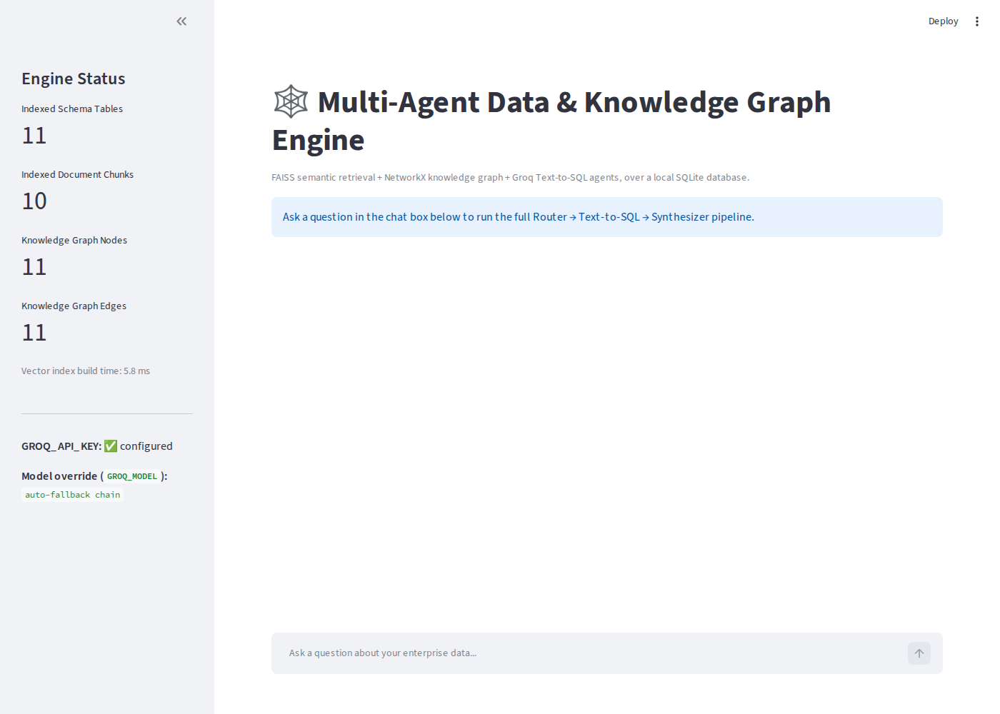
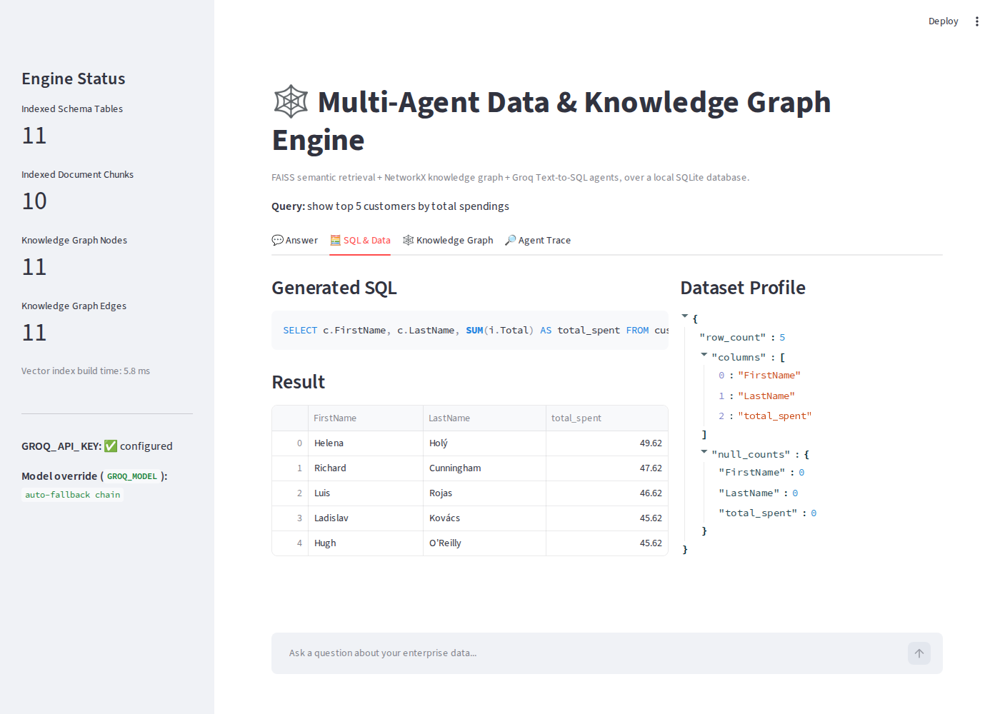
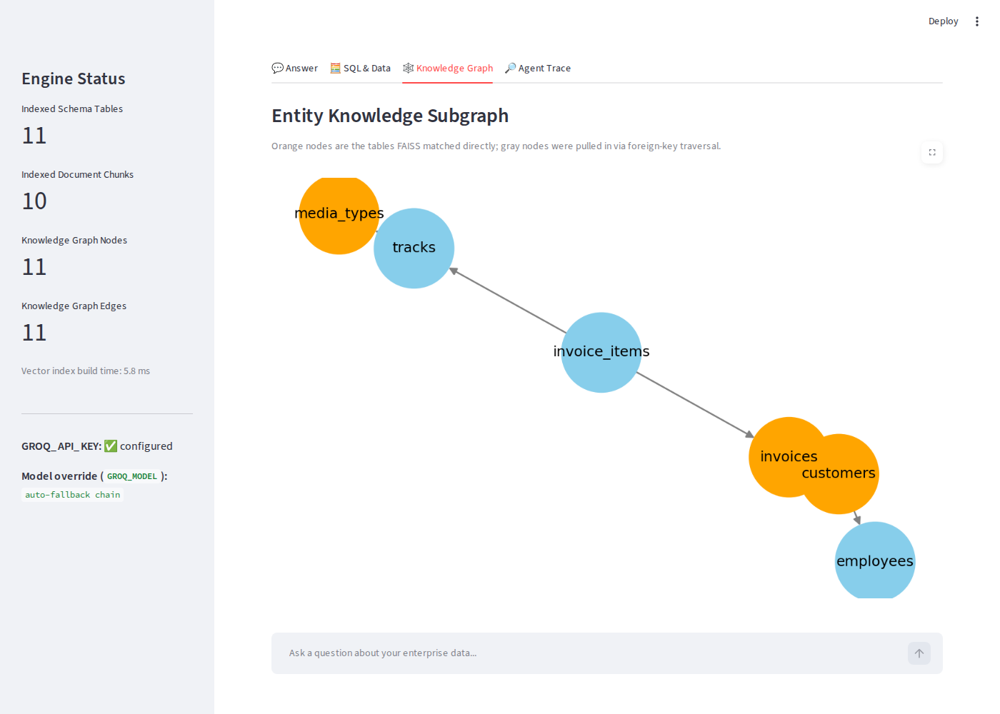
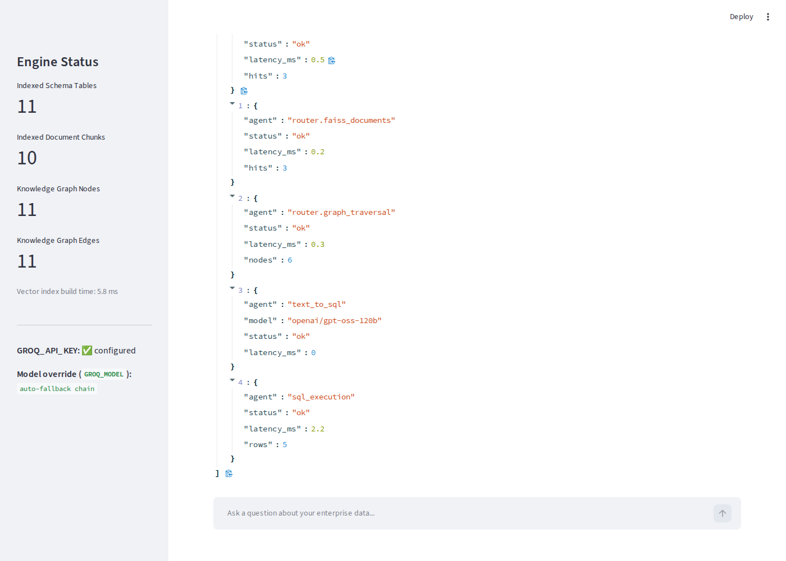

# Multi-Agent Data & Knowledge Graph Engine

An interactive Streamlit app that turns natural language questions about a SQLite database into safe, validated SQL. It uses a hybrid retrieval pipeline (FAISS semantic search plus a NetworkX knowledge graph) and a small pipeline of Groq hosted LLM agents to route the question, write the SQL, run it, and summarize the result.

## Abstract

I built this to go beyond simple keyword search when querying a database in plain English. The engine combines FAISS vector search (semantic retrieval over schema definitions and unstructured business documents) with a NetworkX knowledge graph of foreign key relationships. A small pipeline of agents takes a natural language query, retrieves the relevant schema and document context, traverses the entity graph to find the right joins, generates and safety checks a SQL query, executes it, profiles the result, and renders everything in an interactive dashboard.

## What it does

1. You type a question like "show top 5 customers by total spendings."
2. Agent 1 (Router) embeds the query, searches FAISS for the closest matching tables and document chunks, then walks the NetworkX graph to pull in directly connected tables (the join path).
3. Agent 2 (Text to SQL) sends that context to a Groq hosted LLM, gets back a single JSON object containing the SQL, validates it as a read only SELECT/WITH statement, runs it against SQLite, and profiles the result with Pandas.
4. Agent 3 (Synthesizer) writes a short summary of the result and draws the relevant entity subgraph.
5. Streamlit shows all of it: the answer, the generated SQL and data table, the knowledge graph, and a step by step trace of what each agent did and how long it took.

## Architecture

```
User Query ──> [ Agent 1: Router & Retriever ]
                     |
       ┌─────────────┴─────────────┐
       v                           v
[ Vector Search (FAISS) ]   [ Knowledge Graph (NetworkX) ]
 (Schema & Documents)       (Foreign Key Traversal)
       |                           |
       └─────────────┬─────────────┘
                     v
        [ Agent 2: Text to SQL & Profiler ]
           (Groq LLM, JSON schema output,
            SELECT only safety validation)
                     |
                     v
       [ Structured JSON & SQL Output ]
                     |
                     v
        [ Agent 3: Synthesizer & Visualizer ]
        (summary + NetworkX subgraph plot) ──> Streamlit UI
```

**Agent 1, Router & Retriever** (`agents/router.py`): embeds the query with `all-MiniLM-L6-v2`, searches FAISS for the closest schema tables and, separately, the closest business document chunks, then expands the matched tables to their directly connected neighbors in the NetworkX foreign key graph.

**Agent 2, Text to SQL & Profiler** (`agents/text_to_sql.py`): sends the retrieved context to a Groq hosted LLM and asks for a single JSON object `{"sql": "..."}`. Every returned query is validated as a read only `SELECT`/`WITH` statement before it touches `sqlite3`. Results are profiled with Pandas (row count, columns, null counts).

**Agent 3, Synthesizer & Visualizer** (`agents/synthesizer.py`): produces a short summary of the result and renders the query's entity subgraph with `networkx`/`matplotlib`, highlighting the tables FAISS matched directly.

Groq periodically retires or renames models, so Agent 2 does not hardcode a single model. It tries an ordered fallback chain (`GROQ_MODEL` from your `.env` first, then `openai/gpt-oss-120b`, `openai/gpt-oss-20b`, `llama-3.3-70b-versatile`, `llama-3.1-8b-instant`, `groq/compound`) and only raises an error once every candidate has failed. If you ever hit a "model not found" error, run `python scripts/test_groq.py` to see which models your API key can actually reach and set `GROQ_MODEL` in `.env` to pin one.

## Tech stack

* UI and dashboarding: `streamlit`, `matplotlib` for graph rendering
* Vector store and embeddings: `faiss-cpu`, `sentence-transformers` (`all-MiniLM-L6-v2`)
* Knowledge graph: `networkx`
* Agent orchestration: Python, `pandas`, `sqlite3`, `pydantic`
* LLM provider: Groq API (`groq` SDK)

## Project structure

```
.
├── app.py                          # Streamlit UI, wires the 3 agents together
├── agents/
│   ├── router.py                   # Agent 1: FAISS + NetworkX retrieval
│   ├── text_to_sql.py              # Agent 2: Groq Text-to-SQL + profiling
│   └── synthesizer.py              # Agent 3: summary + graph visualization
├── utils/
│   ├── faiss_indexer.py            # Vector store over schema + documents
│   └── graph_builder.py            # Builds the NetworkX FK graph from SQLite
├── data/
│   ├── chinook.db                  # Sample SQLite database
│   └── documents/                  # Unstructured business docs (indexed)
├── scripts/
│   ├── test_groq.py                # CLI to check which Groq models work
│   └── benchmark_vector_search.py  # FAISS scale/latency benchmark
├── docs/screenshots/                # Screenshots below
├── requirements.txt
└── .env.example
```

## Setup

```bash
python -m venv venv
source venv/bin/activate            # Windows: venv\Scripts\activate
pip install -r requirements.txt

cp .env.example .env
# edit .env and set GROQ_API_KEY=gsk_...

streamlit run app.py
```

The app opens at `http://localhost:8501`. Try a question like "show top 5 customers by total spendings" or "which genre sells the most tracks."

To sanity check your Groq connection on its own, without going through Streamlit:

```bash
python scripts/test_groq.py --prompt "Say hello in one sentence."
```

## Benchmarks

The live app indexes a small, fast corpus on every session start (schema tables plus a handful of document chunks, under 10ms to build). To validate the "50,000+ vectors under 120ms" retrieval target at production scale, `scripts/benchmark_vector_search.py` builds a full size FAISS index at the same 384 dimensions as `all-MiniLM-L6-v2` and measures real query latency:

```bash
python scripts/benchmark_vector_search.py --num-vectors 50000 --num-queries 300
```

Results from my own run (raw numbers in `scripts/benchmark_results.json`, regenerate on your own hardware for your own numbers):

| Metric | Value |
|---|---|
| Vectors indexed | 50,000 |
| Embedding dimension | 384 (matches `all-MiniLM-L6-v2`) |
| Index build time | 67.2 ms |
| Query latency, p50 | 12.8 ms |
| Query latency, p95 | 15.1 ms |
| Query latency, p99 | 17.9 ms |
| Query latency, max | 47.4 ms |

All well under the 120ms target. The benchmark uses random vectors at the production embedding dimension so it can run offline without a network call to download the embedding model. Pass `--use-sentence-transformers` to benchmark with real `all-MiniLM-L6-v2` embeddings end to end instead. FAISS's `IndexFlatL2` search cost depends on vector count and dimensionality, not content, so this measures genuine retrieval engine performance at scale.

## Screenshots

Dashboard on startup, sidebar shows live index and graph stats:



Generated SQL, result table, and dataset profile:



Entity knowledge subgraph, orange nodes are the tables FAISS matched directly, gray nodes were pulled in via foreign key traversal:



Agent execution trace, per step latency for every retrieval and model call:



## Safety

Every SQL query the LLM proposes is validated before execution. It must:

* start with `SELECT` or `WITH`
* not contain `INSERT`, `UPDATE`, `DELETE`, `DROP`, `ALTER`, `ATTACH`, `DETACH`, `PRAGMA`, `VACUUM`, `REPLACE`, or `CREATE`
* be a single statement, no stacked queries separated by `;`

Anything that fails these checks raises `agents.text_to_sql.SQLSafetyError` and is shown in the UI as a blocked for safety warning instead of being executed.

## Limitations and roadmap

* The live app's vector index is intentionally small (schema plus a few documents) for a fast session startup. Use the benchmark script for scale testing.
* `IndexFlatL2` is exact but scans linearly per query. For a much larger corpus, swap in `IndexIVFFlat` or `IndexHNSWFlat` and re-run the benchmark.
* The document corpus in `data/documents/` is a small illustrative set. Point `VectorIndexer(docs_dir=...)` at your own document folder to index real enterprise documents.
